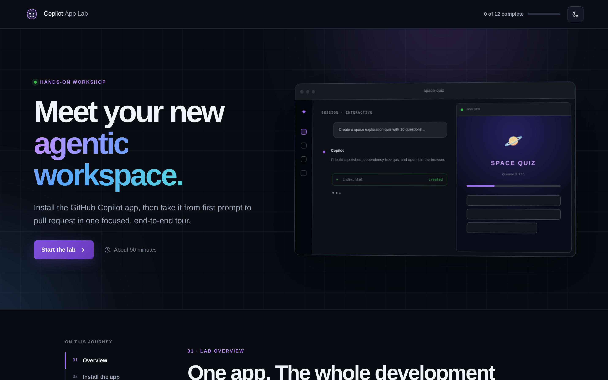
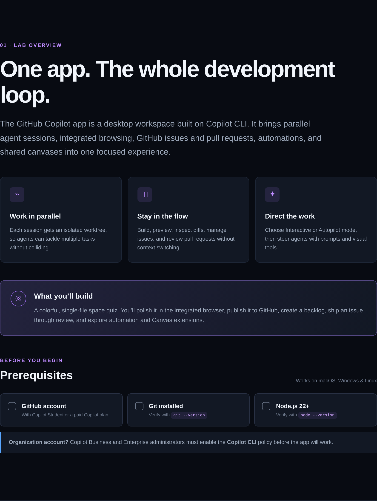
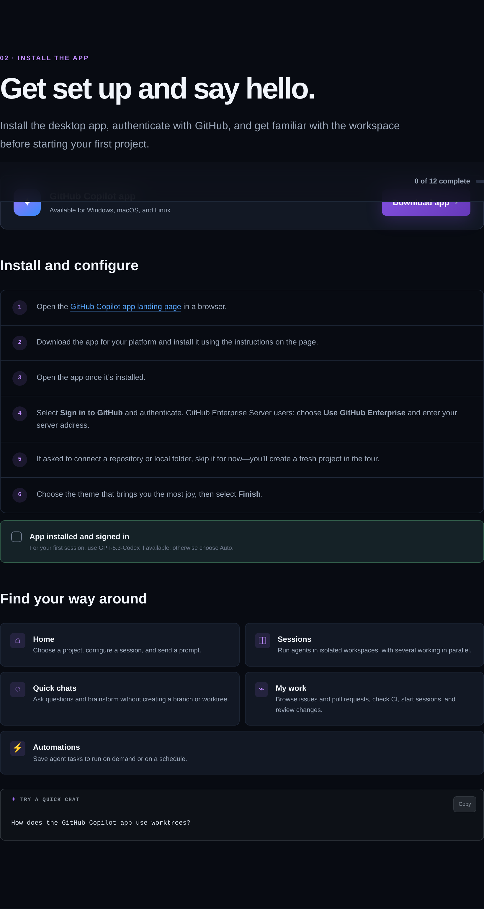
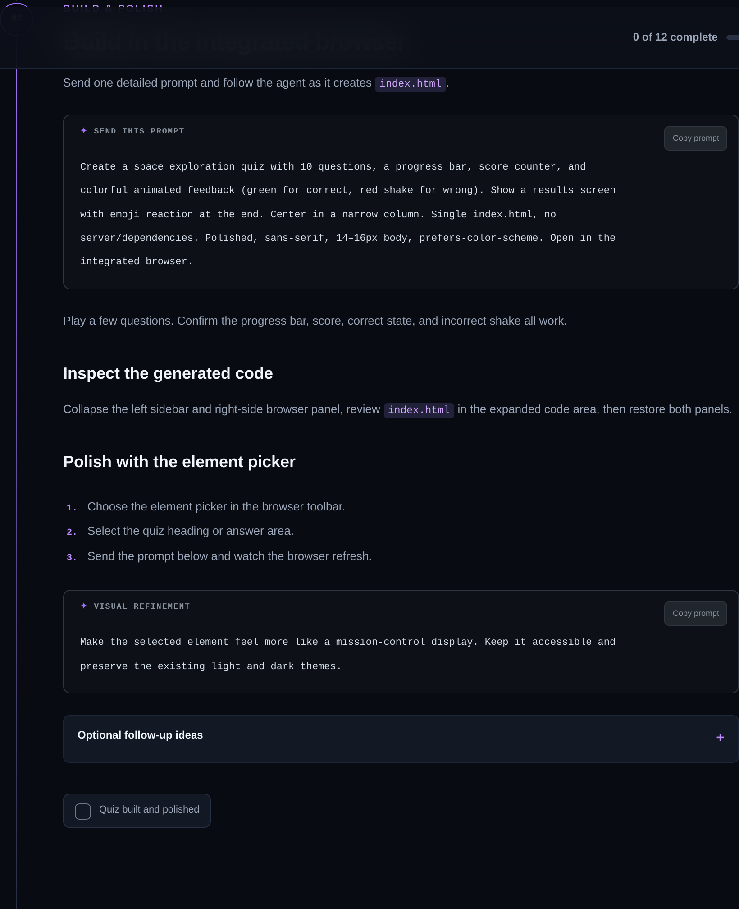
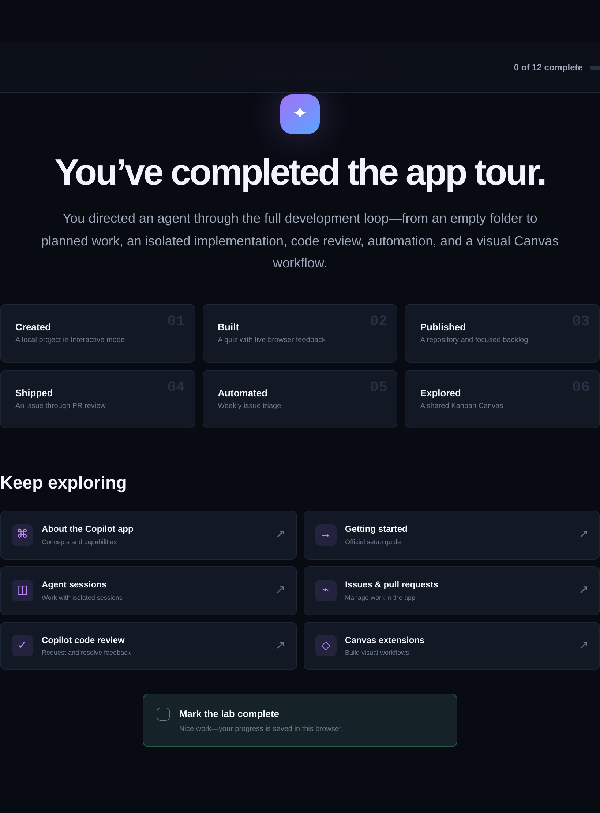
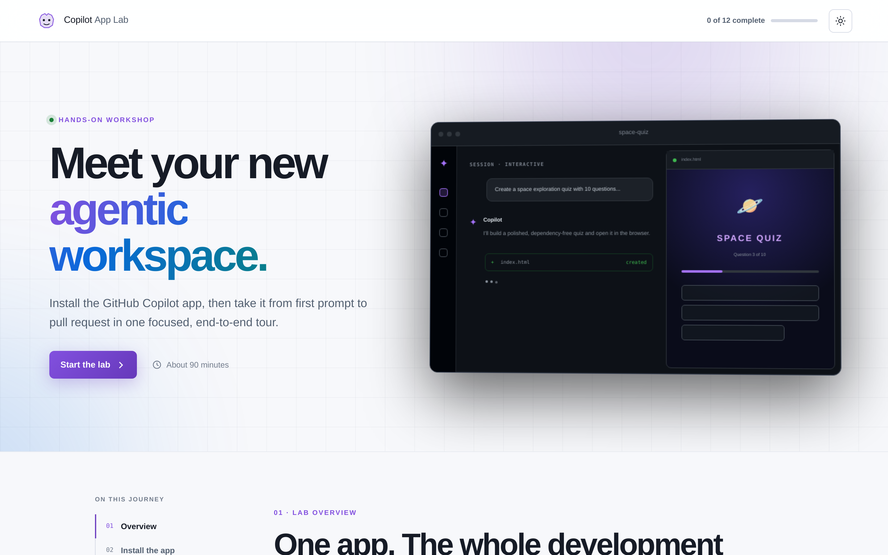

<div align="center">

# 🚀 GitHub Copilot App Lab

**A beginner-friendly, hands-on tour of the GitHub Copilot app — from first prompt to reviewed pull request.**

[](https://jamesmontemagno.github.io/github-copilot-app-lab/)
[](https://github.com/jamesmontemagno/github-copilot-app-lab/actions/workflows/deploy-pages.yml)
[](LICENSE)

### 👉 **[Start the lab →](https://jamesmontemagno.github.io/github-copilot-app-lab/)**



</div>

---

## ✨ What is this?

The **GitHub Copilot App Lab** is a self-paced, single-page workshop that walks you through the GitHub Copilot desktop app — a workspace built on Copilot CLI that brings parallel agent sessions, an integrated browser, GitHub issues and pull requests, automations, and shared Canvases into one place.

You’ll build a colorful **`space-quiz`** app from an empty folder and take it all the way through the development loop:

| | Stage | What you do |
| :--: | :-- | :-- |
| 01 | **Create** | Start an Interactive session on a local folder |
| 02 | **Build & polish** | Ship a single-file quiz and refine it in the integrated browser |
| 03 | **Publish** | Initialize Git and push a public repository |
| 04 | **Issues & sessions** | Generate a backlog and implement one issue in an isolated worktree |
| 05 | **Review** | Open a PR, request Copilot review, and resolve the feedback |
| 06 | **Automate** | Schedule a weekly issue-triage automation |
| 07 | **Canvas** | Kick off work from a shared Kanban Canvas extension |

⏱️ **About 90 minutes** · 💻 macOS, Windows & Linux · ✅ Progress is saved in your browser

---

## 📸 A look inside the lab

<table>
  <tr>
    <td width="50%"></td>
    <td width="50%"></td>
  </tr>
  <tr>
    <td align="center"><strong>Guided overview &amp; prerequisites</strong></td>
    <td align="center"><strong>Install, sign in, and find your way around</strong></td>
  </tr>
  <tr>
    <td width="50%"></td>
    <td width="50%"></td>
  </tr>
  <tr>
    <td align="center"><strong>Copy-ready prompts for every step</strong></td>
    <td align="center"><strong>Recap and curated documentation</strong></td>
  </tr>
</table>

Prefer the light side? The lab ships with a built-in theme toggle.



---

## 🧭 Lab highlights

- **Checklists that stick** — 12 checkpoints tracked in `localStorage`, with a live progress pill and a reset button.
- **One-click prompts** — every prompt in the lab has a copy button, so you can paste straight into the app.
- **Dark & light themes** — respects `prefers-color-scheme` and remembers your choice.
- **Zero dependencies** — plain HTML, CSS, and JavaScript. No build step, no framework, no tracking.

---

## ✅ Prerequisites

- A GitHub account with Copilot Student or a paid Copilot plan
- [Git](https://git-scm.com/downloads) installed (`git --version`)
- [Node.js 22+](https://nodejs.org/) (`node --version`)
- The [GitHub Copilot app](https://gh.io/app) for your platform

> **Organization account?** Copilot Business and Enterprise administrators must enable the **Copilot CLI** policy before the app will work.

---

## 🛠️ Run locally

The site has no build step or runtime dependencies. Serve the repository root with any static file server:

```bash
python3 -m http.server 8000
```

Then open <http://localhost:8000>.

## 📦 Project structure

```text
index.html             # The entire lab, section by section
styles.css             # Theme tokens, layout, and components
script.js              # Progress tracking, theme toggle, copy buttons
assets/favicon.svg     # Site icon
assets/screenshots/    # Images used in this README
.github/workflows/     # GitHub Pages deployment
```

## 🚢 Deploy

The **Deploy to GitHub Pages** workflow publishes the repository root whenever changes are pushed to `main`. Enable **GitHub Actions** as the Pages source in the repository settings.

## 📚 Keep exploring

- [About the GitHub Copilot app](https://docs.github.com/copilot/concepts/agents/github-copilot-app)
- [Getting started](https://docs.github.com/copilot/how-tos/github-copilot-app/getting-started)
- [Agent sessions](https://docs.github.com/copilot/how-tos/github-copilot-app/agent-sessions)
- [Copilot code review](https://docs.github.com/copilot/concepts/code-review/code-review)
- [Canvas extensions gallery](https://awesome-copilot.github.com/extensions/)

## 🙏 Source

Lab content is adapted from the [NDC Oslo Copilot Workshop](https://github.com/jamesmontemagno/ndc-oslo-copilot-workshop) and its [Copilot Workshops](https://github.com/github-samples/copilot-workshops) source.

## 📄 License

Released under the [MIT License](LICENSE).
